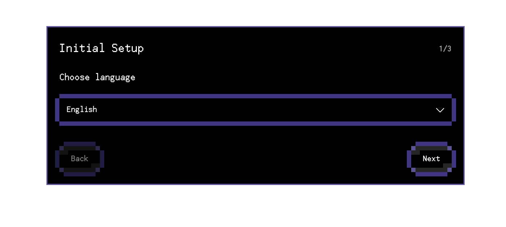
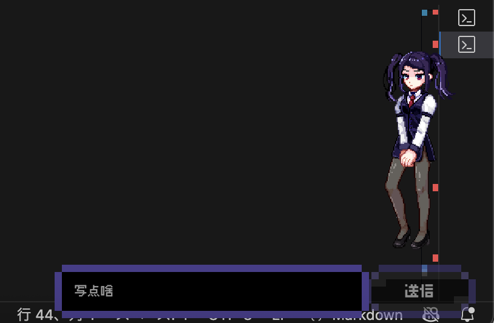
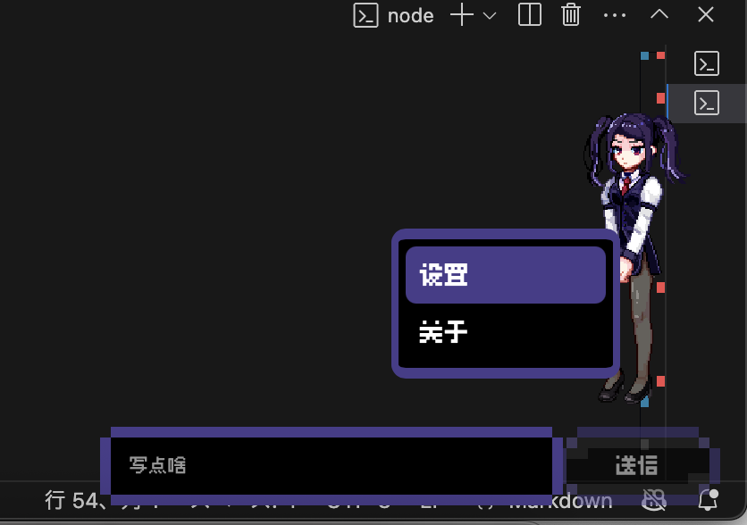

# MN-3MO SYNE Friend Mode 试用说明

请注意：这还是个非常早期的版本

你会见到一个叫 P 的本地数据酒保。她会读取你指定目录里的文件，把它们当成“原料”来聊天、点评、调酒，并在你确认后处理这些文件。

## 它能做什么

- 和你聊天，而且会保持酒保 P 的口吻
- 查看你指定目录里的文件，把它们当作“调酒原料”
- 在你说“来一杯”之类的话时，自己挑 2-3 个文件做一杯“数据鸡尾酒”
- 暂时拿走这些文件，等你决定是“喝掉”还是“放回去”
- 记住一部分长期偏好或上下文
- 如果你太久不理她，她可能会自己开始翻文件

## 开始

friend-mode 已经内置模型配置，正常情况下**不用手动填 API**。

第一次启动时，你只需要配 3 件事：

1. 选择语言
2. 选择 `.bar` 的父目录
3. 选择“调酒目录”，也就是 P 可以翻找的文件目录

## 这两个目录分别是什么

### 1. `.bar` 父目录

这是程序放“吧台缓存”的地方。P 在调酒时会先把文件暂存到这里，再等你决定下一步。

建议：

- 选一个单独的新文件夹
- 不要和日常工作目录混用

### 2. 调酒目录

这是 P 会读取、挑选和调酒的目录。

强烈建议：

- 不要放任何你不想被读取或误删的内容

## 基础操作

按住P拖动可以挪位置

在P身上右键可以打开上下文菜单

## 怎么用

### 1. 直接聊天

你可以随便和她说话，比如：

- “你这里有什么原料？”
- “来一杯。”
- “看看这个文件。”
- “记住我以后喜欢短一点的回复。”

### 2. 让她调一杯

如果你不指定文件，P 通常会自己从调酒目录里挑东西。

如果你指定了某个文件，她会先查看，再决定怎么下手。

> [图片位置：主界面 / 对话界面]

### 3. 决定这杯酒的结局

调酒完成后，相关文件会先进入暂存状态，不是立刻永久消失。

之后一般有两种结果：

- `drink`：真的喝掉，也就是删除这些已暂存文件
- `restore`：把文件放回原位

如果你不确定，就先恢复。

### 4. 改设置

设置页里可以调整这些内容：

- 是否在退出时让 P 记住这次会话
- 是否开机自启
- 是否窗口置顶
- 挂机多久后自动调酒
- 文字播放速度
- 音效音量
- 调酒目录

## 注意事项

### 1. 这是会碰文件的程序

它不是纯聊天玩具。P 会读取你给她的目录，也可能在你确认后删除文件。

所以不要把调酒目录设定到什么有重要文件的地方

### 2. 不要把它当云盘整理工具

它的重点是体验和互动，不是严肃的文件管理器。

### 3. 它会“记住一点东西”

如果你打开了“退出时让 P 记住这次会话”，程序会保存一小段适合下次继续使用的总结。

不建议在对话里主动输入不希望被长期记住的敏感内容

### 4. 挂机时她可能自己动手

默认会在挂机一段时间后自动调酒。

如果你不想让她自己翻文件，可以去设置里把“挂机后自动调酒等待时间”调成 `0`。

### 5. 如果你只是想安全看看气氛

最稳妥的试玩方式是：

1. 新建一个测试文件夹
2. 丢几份无关紧要的 txt、截图、草稿、旧文档进去
3. 把这个文件夹设为调酒目录
4. 先体验聊天、看原料、调酒，再碰删除

## 遇到问题时

如果你发现下面这些情况，可以直接反馈：

- 启动后卡住
- 选完目录没反应
- P 一直不回话
- 调酒后文件状态不对
- 恢复失败或删除结果异常
- 文本显示、语言切换、音效有问题

反馈时如果能带上：

- 你当时选的目录类型
- 你输入的大概句子
- 出问题前最后一步做了什么
- 截图

会更容易复现。

## 一句话版本

把它当成一个会损你两句、会翻你测试文件夹、还能真动文件的本地酒保程序来玩，就差不多了。

